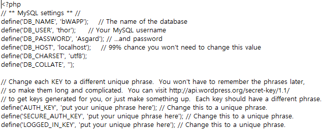
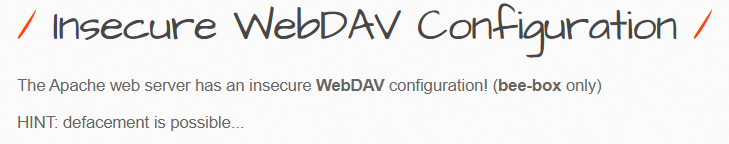

## Definition

- 잘못된 보안 구성
- 잘못되거나 과도한 보안 설정으로 발생

## 1. Robots File

### Object

- bWAPP의 robots.txt 파일 확인하는 시나리오
- 더 나아가, 구글 해킹의 대응방안에 관한 위협을 알아보자

### robots.txt

- 페이지에 대한 접근 권한을 설정하는 파일, 웹 크롤러의 접근 범위 설정 가능

|         명령어         |            내용            |
| :--------------------: | :------------------------: |
|     User-agent : *     |       모든 검색 엔진       |
| User-agent : googlebot |       구글 검색 엔진       |
|       Allow : /        |  모든 디렉토리 접근 허용   |
|   Disallow : ex.ini    |  'ex.ini' 파일 검색 차단   |
|   Disallow : /admin/   | 'admin' 디렉토리 접근 차단 |
|       Disallow :       |     사이트 크롤링 허용     |

### 난이도 : 하

- GoodBot : 사이트 크롤링 허용
- BadBot : 모든 디렉토리 접근 차단
- AllBot : /admin/, /document/, /images/, /passwords/ 디렉토리 접근 불가

### /admin/ 

- 관리자 페이지에 페이지 인증 과정 없이 직접 접근 가능
- 관리자 계정인 'bee/bug', 내부 IP정보, 서버 정보 노출

### /psswords/

- wp-config.bak 파일에 접근

- DB 접속 정보 평문으로 노출

### 대응방안

- 중요 디렉터리는 외부에 노출되지 않도록 접근 권한 설정 필요
- 하지만, 페이지에 인증처리를 하지 않을 시 역으로 공격당할 수 있음

### 구글 대응

- 모든 디렉터리 검색 제한은 마케팅 차원에서 비효율적
- 앞서 살펴보았듯이 디렉터리 접근 권한 및 애플리케이션 대응방안을 적용하고
- 추가적으로 마케팅을 고려한 대응방안 적용해야 함

## 2. Insecure WebDAV Configuration

### Object

- bWAPP에 WebDAV 기능 활성화로 디렉토리 검색 및 악의적인 파일을 업로드하는 시나리오
- PUT Method를 이용해 WebDAV에 악의적인 파일을 업로드하는 취약점을 다뤄보자

### WebDAV

- 원격적으로 웹 서버를 제어할 수 있는 HTTP Protocol의 확장 기능
- 보안설정 미흡할 시 악성 스크립트가 포함된 파일 업로드하여 시스템에 침투 우려
- 기존 파일 수정하여 악의적인 행위 우려
- PUT Method를 허용하는 몇몇 서비스에서 악성 웹셸 업로드될 우려

### 난이도 : 하

### /webdav/

