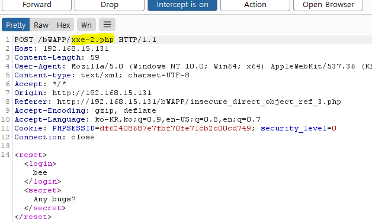

 

## Direct Object References

서버 내부에 구현된 객체의 참조를 허용하는 것

 

 

## Insecure Direct Object References

주로 파일, DB Key, URL에 노출된 세션 아이디를 통해 조작 가능

접근 제어나 검증 절차가 없으면 공격자는 허가 없이 객체 참조를 조작하여 데이터에 접근 가능

 

 

## Reset Secret

### Object

비밀번호 힌트 변경 요청 없이 초기화할 비밀번호 힌트 전송

버프스위트로 요청 값을 가로챈 후 다른 사용자의 비밀번호 힌트를 초기화해보자

 

### 시나리오 - 난이도 : 하

 

### Burpsuit - 1

- intercept on - Any Bugs? 버튼 클릭

 

### Burpsuit - 2

- 임의의 사용자로 변경
- secret 값도 변경
- intercept off로 패킷 넘기기

 

 

## 확인 - A1. Injection - SQL Injection (Login Form/User)

### 변경 전

 

### 변경 후

 

 

## 대응방안

### BeeBox - 1

- 디렉토리 변경
- xxe-2.php를 호출하여 비밀번호 힌트 초기화하므로 vi 편집기로 xxe-2.php(해당 웹페이지) 소스 코드 열기

 

### Beebox - 2

- xxe-2.php 페이지는 난이도 중 이상부터 변수에 입력된 값 필터링
- 난이도 상에서는 로그인 변수에 사용하는 아이디를 세션에서 입력받아 입력하므로 버프스위트로 수정하여도 해당 사용자의 아이디와 비밀번호 초기화 됨
-  mysqli_real_escape_string : Null, \n, \r, \, ', ", ^Z 문자에 백슬래시를 붙여 SQL Injection 공격 방어
-  XML 코드를 일반 문자로 변경하여 XXE 공격에 방어
-  MYSQL UPDATE __ SET __ 구문으로 secret 변수에 입력된 내용으로 비밀번호 힌트 초기화
