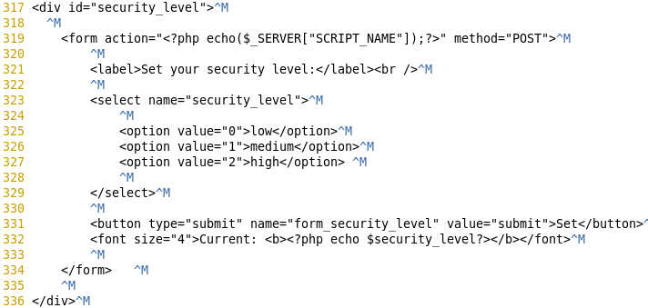

# Definition

접근 통제와 확인이 서버의 설정이나 관리 측면에서 이루어지지 않을때 발생하는 취약점

대표적으로 파일 다운로드와 업로드 취약점을 이용하여 웹 서버에 접근하는 공격

# Directory Traversal

주로 파일 다운로드 취약점과 같은 뜻으로 사용

상대경로나 기본으로 설정된 파일명, 디렉터리명을 통해 접근을 허용하지 않은 디렉터리나 파일에 접근

때문에 공격자는 시스템과 DB의 정보를 수집 가능

# Directories

## Object

GET 메소드를 사용하는 웹 페이지(bwapp - Directories)의 특성을 이용해 서버에 있는 디렉토리 정보를 알아보자

## 시나리오

### 난이도 : 하

- HTTP 연결 요청으로 GET 메소드 사용하므로 URL에 변수가 보이는 형태
- 'Robots.txt' 시나리오에서 확인했던 디렉토리 중 'documents'에 업로드 되어있는 파일들 확인
- 'documents'를 'passwords' 디렉토리로 수정

### passwords

- 'passwords' 디렉토리로 이동
- accounts.txt, heroes.xml 파일에서 웹 사이트에 사용하는 계정 정보가 담겨있다고 추측

### ../ 상대경로

- 상대경로 이용해 해당 웹페이지의 상위 디렉토리 정보 확인 가능
- etc로 이동

### ../../../etc

- 여러 파일들 확인 가능
- Ctrl + F 로 passwd에 계정 정보가 있다고 추측
- passwd 클릭 or ../../../etc/passwd

### passwd

- passwd가 디렉터리가 아닌 파일이기 때문에 접근 불가
- 다음 게시물인 Files 시나리오에서 다뤄볼 예정

# 대응방안

## Beebox

### Beebox - 1

- 디렉토리 변경
- vi 편집기로 해당 웹 소스코드 열기

### Beebox - 2

- 난이도 확인

### Beebox - 3

- "case 0 : 난이도 하"에서는 아무런 보안 조치 X
- "case 1 : 난이도 중"에서는 directory_travesal_check_2 함수 사용
- "case 2 : 난이도 상"에서는 기본 경로 변수를 base_path로 documents로 지정하여 상대경로에 대한 접근 방지
- 또한 "난이도 상"에서 directory_traversal_check_3 함수 사용

### Beebox  - 4

- vi functions_external.php로 확인
- "directory_travesal_check_2"에서 상대경로를 통한 접근을 막기 위해 해당 특수문자를 검열하고 그를 통해 감지되었다는 메시지 출력
- "directory_traversal_check_3"에서 관리자가 지정한 디렉토리와 사용자가 입력한 디렉토리 경로가 다를 경우 오류 메시지 출력
