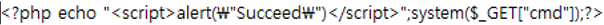

 

## Missing Functional Level Access Control

접근 통제와 확인이 서버의 설정이나 관리 측면에서 이루어지지 않을때 발생하는 취약점

대표적으로 파일 다운로드와 업로드 취약점을 이용하여 웹 서버에 접근하는 공격

 

 

## File Inclusion

악의적인 코드가 입력된 파일을 공격자가 서버에 업로드하여 사용자가 열람하는 공격

 

### LFI(Local File Inclusion)

서버 내부에 있는 파일을 확인하는 공격

서버에 접근하는 변수 중 취약한 변수에 상대경로(../)를 사용하여 서버 내부에 접근

 

### RFI(Remote File Inclusion)

공격자가 악성 코드가 있는 원격 서버의 파일을 공격 대상인 웹 애플리케이션 서버에서 실행시켜 취약한 웹 페이지에 악의적인 스크립트를 실행하게 하는 공격

 

 

## Local File Inclusion (LFI)

### Object

GET 방식으로 HTTP 요청을 사용하는 웹 페이지의 URL에 상대경로(../)를 이용하여 정보를 갈취해보자

- Go 버튼 클릭 시 URL에 변수(language) 노출

 

### URL

- 변수에 ../../../../../etc/passwd 로 상위 파일 상대경로와 etc 디렉터리, passwd 파일 설정
- 데이터베이스 내의 비박스 계정 패스워드 정보 열람

 

 

## Remote File Inclusion(RFI)

### Object

특정 bWAPP 시나리오에 특정 스크립트 삽입하여 (LFI/RFI) 시나리오에 원격 공격을 시도해보자

 

### A6. Sensitive Data Exposure - Text Files (Accouts)

- <?php echo "";system($_GET["cmd"]);?>
- 해당 스크립트 Username에 삽입하여 [insert] 버튼으로 경고창 스크립트 파일(accounts.txt) 생성
- Download  클릭 시 accounts.txt(공격에 사용될 PHP 파일) 창으로 이동

 

### Remote & Local File Inclusion (RFI/LFI)

 

### passwords/accounts.txt 입력

 

 

## 대응방안 - Beebox

### Terminal

- 디렉토리 변경
- vi 편집기로 해당 시나리오 소스 코드 조회

 

### rlfi.php

- Level 확인

 

### LFI

- language 변수에 입력할 내용을 배열로 한정하는 화이트 리스트 방식을 사용
- 즉, 안전이 증명된 값만을 취함

 

### RFI

- language 변수에 들어오는 입력 값을 생성한 배열로 검증하기 때문에 RFI 공격에 사용한 cmd 변수나 URL은 입력하지 못함
