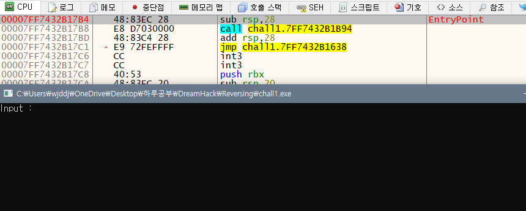

 

## 문제

## 프로그램

## 패킹

- C++로 패킹 확인
- 언패킹 과정 필요없다 판단

## X64dbg

## 실행(R)

- 여기서 멈춤
- 한 번 더 실행

## 실행(R)

- 프로그램 실행했을 때 처럼 문자열 입력할 수 있게 'Input : ' 등장
- 다시 처음으로 돌아가서 실행을 한 번하고 
- 멈춘 곳에서 '건너서 단계진행(O)'으로 정확히 어디부분에서 문자열 입력할 수 있는 'Input : '이 등장하는지 살펴보자

## 건너서 단계진행(O)

- 화살표 가르킨 call 함수로 호출하는 부분에서 'Input : '이 등장
- 이 부분에서 '안으로 단계진행(I)'으로 해당 호출 주소로 들어가보자

## 안으로 단계진행(I)

- 안으로 들어와 본 결과
- 4번에서 문자열이 맞다면 Correct / 다르다면 Wrong 문자열을 출력하는 분기점을 발견할 수 있다.
- 그리고 분기로 가는 과정에서 call 함수를 세번 사용하는 코드를 발견할 수 있는데
- 1번 함수에서는 프로그램시 발견할 수 있는 'Input : '을 출력하는 역할을하고
- 2번 함수에서는 사용자가 문자열을 입력할 수 있도록 하며
- 3번 함수에서는 4번 분기점에서 인자로 사용하는 eax값을 쓰는 것을 확인할 수 있다
- 우리는 해당 프로그램의 정답 문자열을 출력해야하기 때문에 Correct를 출력해서 그에맞는 문자열을 찾아야 하므로 4번의 test eax,eax에서 eax 값을 1로 반환해야 한다.
  - test eax, eax는 eax 값이 0인지 확인하는 함수
- eax 값이 1로 반환하기 위해서는 eax가 마지막으로 쓰인 3번째 call 함수로 들어가서 확인해보자

## 안으로 단계진행(I)

- 3번째 call 함수에서 호출하는 부분이다.

- 같은 함수 패턴으로 반복되는 구문이다.
- 먼저 코드를 분석해보자
  - 첫번째 사진 시작점부터 보면
  - rcx(사용자가 입력한 값)을 rsp+8에 적재하고 eax에 1을 적재한다
  - Imul 함수로 rax에 rax*0을 저장하고
    - imul 함수 인자 두개일 경우 첫번째 인자와 두번째 인자를 곱한 결과를 첫번째 인자에 저장
    - 인자 세개일 경우 두번째 인자와 세번째 인자를 곱한 결과를 첫번째 인자에 저장
  - 그리고 사용자가 입력한 값을 eax에 저장
  - eax에 저장된 값과 43(Hex)값을 비교하여 참일시에 je명령어 성공적으로 실행되어 eax값 1반환하는 패턴이다.
- 쭉 같은 분기가 반복되다가 두번째 사진 1번 분기만 충족할 시에 2번 분기는 자동적으로 충족되어
  - mov eax, 1 이 실행되어서 eax값이 1로 반환된다.
- 즉, 모든 패턴에 해당하는 문자열이 사용자가 입력한 문자열과 같다면 eax에 1이 반환되어 최종적으로 Correct를 출력할 것임
- 그러므로 우리가 찾는 문자열은 위 코드의 문자들을 종합한
  - 'Compar3-the-ch4ract3r' 이다.

## 정답

FLAG VALUE : DH{Compar3_the_ch4ract3r}
