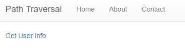

<br>

## 문제


## 접속 정보




## 문제 파일 코드


- 사용자 계정 guest와 admin 확인


- POST 방식으로 /api/user/{userid}를 요청하는 것 확인


- @app.route 에서 @는 장식자를 나타내는데

  - 장식자는 flask에서 주로 URL 연결에 사용하고
  - 다음 행의 함수부터 장식자가 적용됨

  - 즉, @app.route(/api/flag)는 host1.dreamhack.games:17317/getinfo/api/flag를 가리킴

- /api/flag에 접근하면 return FLAG를 통해 FLAG를 획득 가능하다

- 그렇다면 api/user/{userid}로 요청되기 때문에 /api/flag에 접근하기 위해서는

  - 상위 경로를 나타내는 명령어 ../를 활용해 ../flag로 입력을 해보자


## Get User Info


## guest - View


- 코드에서 봤던 users에 기재되어있던 문자열들이 출력되는 것 확인


## admin - View


- admin 으로 View를 하니 출력된 문자열은 users에 있던 admin 내용이지만 
- userid에는 guest로 고정되어있는 것을 확인
- POST 방식으로 바디부분에 고정된 값을 정의했다고 추측가능
- BurpSuite를 이용해 어떤 값들이 POST 값으로 전달되는지 확인해보자


## BurpSuite


- 패킷을 가로채 보니 userid에 guest 값이 아닌 0으로 요청되는 것 확인


- admin으로 패킷을 가로채 봤더니 userid에 admin이 아닌 1로 요청


- 이번에는 eonion을 입력하여 패킷을 가로채봤더니 userid에 undefined라는 값으로 요청되는 것을 확인했다.
- 즉, 웹상에서 입력을 통해 요청을 해도 다른 값으로 고정되어 조정된 요청값이 출력된다.
- 결과적으로 Path Traversal 공격에 사용할 공격 백터는 userid로 판단할 수 있기에
- userid에 ../flag를 수정해서 패킷을 넘겨보자


- 패킷을 넘기기위해 intercept in on을 눌러 intercept off로 바꿔주자


- 성공


## 결과

```
DH{8a33bb6fe0a37522bdc8adb65116b2d4}
```


