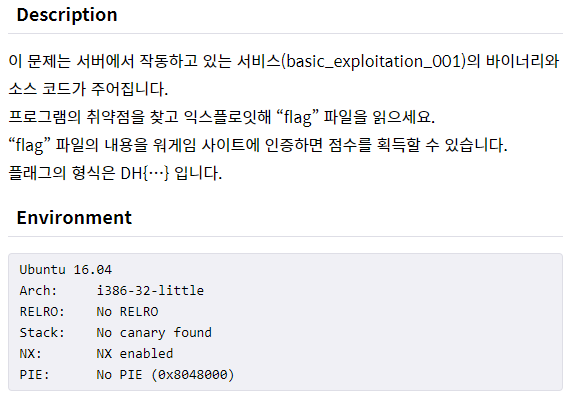
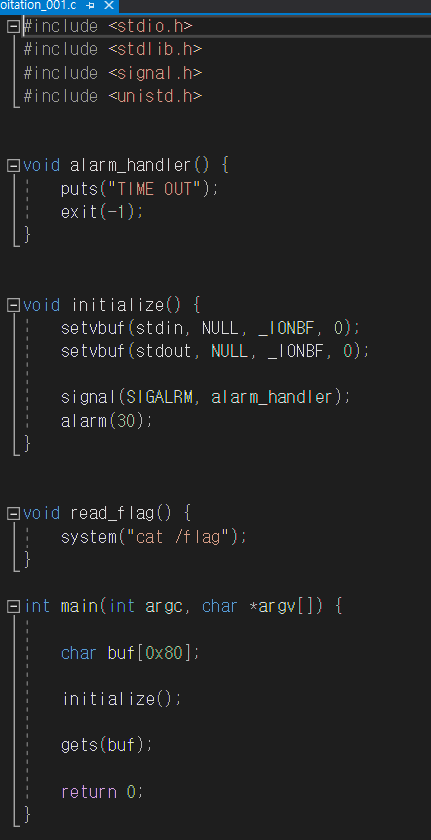
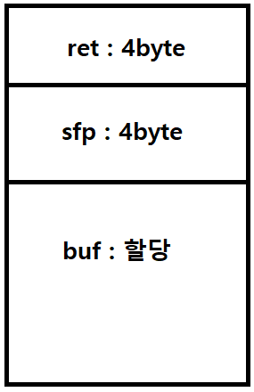
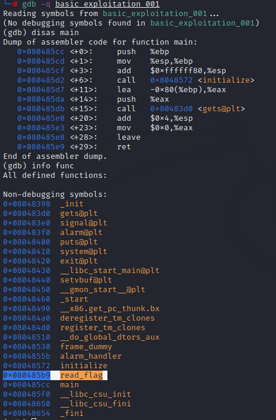
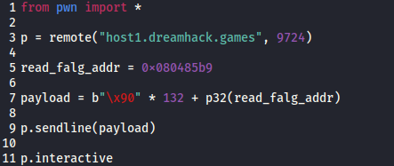
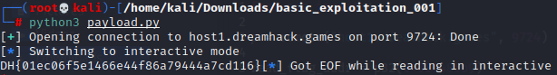

 

## 문제

- 메모리 보호 기법 중 NX 기법 적용된 것 확인
  - 쉘 코드는 불가능할 것으로 판단

## 소스 코드

- initialize 함수 : 실행 이후 정해진 시간 초과시 alarm_handler 함수에 의해  "TIME OUT" 문자열 출력 후 종료 
- read_flag 함수 : system 명령어로 flag 값 보여줌
- main 함수 : buf에 0x80(10진수 = 128) 크기 할당 후 initialize 함수 실행하고 gets로 buf에 입력 받고 반환
  - gets 함수 사용으로 BOF 취약점 확인
  - buf의 크기가 할당 되었으니 Stack BufferOverFlow로 접근해보자
  - 나머지 buf(128byte)와 sfp(4byte)는 특정 값으로 채워주고 ret으로 read_flag 함수의 주소 값을 반환하는 payload를 작성하자

## 스택 프레임

### buffer

데이터가 한 곳에서 다른 곳으로 이동할 때 일시적으로 보관되는 임시 기억공간

메인 함수에서 처럼 할당받아 사용

- 문제 소스 코드에서 0x80(128/10진수)byte로 할당받음

### sfp

스택 베이스값

스택 주소값을 계산할 때 현재 스택값의 기준을 잡을 때 필요한 프레임 포인터 갑을 저장

ebp 레지스터는 한 개이기 때문에 함수가 시작할 때마다 ebp 값이 바뀌는데 그 전의 ebp 값을 스택에다가 저장해야 하기 때문에 sfp 값이 필요

### ret 

반환 주소값

다음에 실행할 명령이 위치한 메모리 주소 값

ret 부분을 원하는 명령이 있는 주소로 덮어쓴다면 원하는 명령을 실행 가능

- 문제 소스코드에서 flag 값을 얻기위해 read_flag 값의 주소를 ret 부분에 덮어줄거다.
- 나머지 buf(128byte)와 sfp(4byte)는 특정 값으로 채워주고 ret으로 read_flag 함수의 주소 값을 반환하는 payload를 작성하자

## Buffer OverFlow(BOF)

### buffer 

데이터가 한 곳에서 다른 곳으로 이동할 때 일시적으로 보관되는 임시 기억공간

### BufferOverflow

- 버퍼의 크기보다 사용자가 입력한 데이터의 크기가 더욱 커서 버퍼의 크기를 벗어날 경우 발생
- 버퍼의 제한된 크기를 벗어나게 되면 다른 메모리 영역을 덮어쓸 수 있는데
  - 이는 악성코드의 실행이 가능하게하며
  - 쉘을 띄울 수 있는 상황까지 도래

### 종류

- Stack BufferOverflow
- Heap BufferOverflow

### BOF 유발 함수

- gets() : 입력받은 문자열의 길이를 확인하지 않기 때문에 취약
- scanf() : 입력받은 문자열의 길이를 체크하지 않기 때문에 스택 변조 위험
- strcat() : 변수의 길이를 체크하지 않기 때문에 BOF 공격에 취약
- strcpy() : 대표적으로 많이 접하는 BOF에 취약한 함수
- sprintf() : 버퍼로 사용될 변수로 출력되는 점에서 BOF에 취약

### 참조(References)

https://blog.naver.com/PostView.naver?blogId=jsky10503&logNo=221202679698&parentCategoryNo=&categoryNo=113&viewDate=&isShowPopularPosts=false&from=postView

## Kali

### gdb

- gdb 이용해서 read_flag 주소를 알아내자	
- 이제 위에서 언급한 페이로드 코드를 작성해보자

## Payload

## 결과

