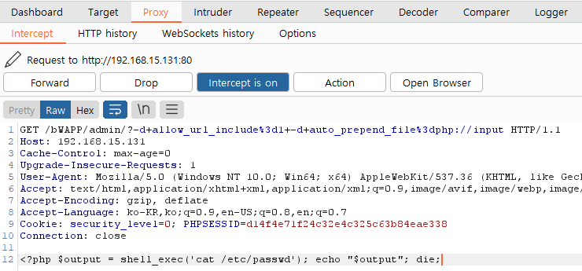

 

## Using Known Vulnerable Components

- 알려진 취약점이 있는 컴포넌트 사용

- 웹 서비스를 운영하는 데 영역별로 다양한 모듈과 라이브러리 사용한다.

- 컴포넌트, 라이브러리, 프레임워크 및 다른 SW 모듈은 대부분 항상 전체권한으로 실행되는데

  이러한 취약한 컴포넌트를 악용하여 데이터 유실 및 서버 권한 획득이 가능한 취약점이다.

  

## CGI(Common Gateway Interface)

- 서버와 애플리케이션(응용 프로그램) 간에 데이터를 주고받는 방법 또는 규약
- 서버가 클라이언트로부터 요청을 수신하면, 이 요청이 처리되어야 할 경우, 서버가 애플리케이션을 실행시키고 이에 대한 응답을 받는 기능을 수행
- WAS가 없었을 당시 Web Server에서 동적 콘텐츠를 처리하기 위해 CGI를 사용했었다.

참조 : https://live-everyday.tistory.com/197

  

## PHP CGI Remote Code Execution

### PHP CGI

- CVE - 2012 -1823
- 2012년 1월에 발견된 취약점
- PHP 5.4.12 이전 버전의 sapi/cgi/cgi_main.c에서 CGI 스크립트가 질의 문자열을 제대로 처리하지 못하여 발생
- 명령어 라인 옵션을 질의 문자열에 포함하여 원격 명령을 실행할 수 있음

 

- PHP는 CGI 기반으로 'mod_cgid'라는 모듈을 사용하여 동작할 때 'php-cgid'가 전달 변수를 받아서 실행
- 정상적으로 아파치와 PHP를 설치하여 사용할 경우 libphp5.so 모듈로 PHP 소스가 실행된다.
- 하지만 php-cgid 모듈을 이용하기 때문에 파라미터 값을 실행하게 되어 예상치 못한 결과가 발생

  

## bWAPP

### object

PHP CGI 취약점을 이용한 원격코드를 사용하여 소스 코드와 노출되어서는 안되는 파일내용을 확인해보자

- -n : php.ini 파일을 사용하지 않음

- -s : 소스코드에 색을 반영하여 출력

- -d : php.ini 에 정의된 설정 내용을 임의로 설정

  -d 옵션

 

### -s 옵션

- 소스코드 노출

 

### -d 옵션

- -d 옵션의 auto_prepend_file=php://input 설정을 사용하여
- '-dauto_prepend_file%3d/etc/passwd+-n'를 입력해줌으로써 중요 정보 노출된 것 확인

  

## BurpSuite

### object

-d 옵션인 auto_prepend_file=php://input 설정을 변경한 후 결과를 body 값 요청으로 전달하여 동일한 결과값을 도출해 보자

 

### /bWAPP/admin/

- BurpSuite를 통해 admin페이지의 패킷을 intercept

 

### 수정

- Forward 버튼 클릭

 

### 확인

- 중요 정보 노출

  

## 대응방안

### 버전 정보

- 현재 버전 정보 확인 후
- 관련 모듈 업데이트 권고

 

### 업데이트

`# apt-get update`

`# apt-get install --only -upgrade openssl`

`# apt-get install --only -upgrade libssl1.0.0`

- 취약한 버전을 사용하고 있다면 위 명령어 통해 최신 버전 업데이트 권고