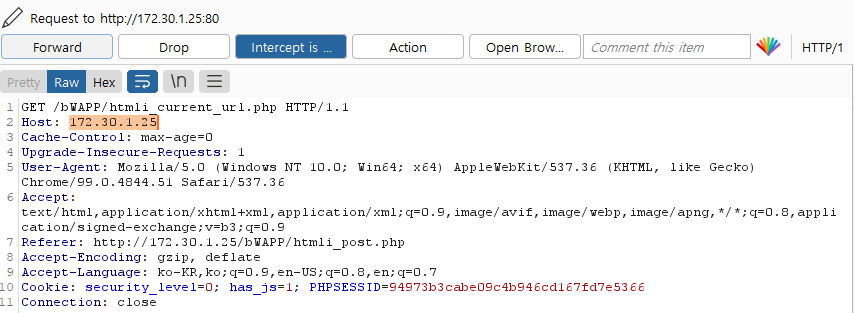
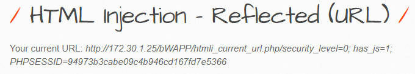

 

## Injection

공격자가 신뢰할 수 없는 입력을 프로그램에 주입하도록 하는 공격.

 

 

## Injection - Reflected

공격자가 태그/스크립트를 삽입한 URL을 클라이언트가 사용했을 경우

서버로 HTTP 요청을 보내고 응답 받을 시 태그/스크립트가 실행되는 방식.

이로 인해 클라이언트는 실제 웹 사이트 접근이 아닌 피싱사이트로 접속하게 되어 개인정보유출 등으로 이어질 수 있음.

 

### GET 방식

클라이언트에서 서버로 어떠한 리소스로 부터 정보를 요청하기 위해 사용되는 메서드

어떠한 정보를 가져와서 조회하기 위해 사용되는 방식

- URL에 변수를 포함시켜 요청
- 데이터를 헤더에 포함하여 전송
- URL에 데이터가 노출
- 캐싱 가능

 

### POST 방식

클라이언트에서 서버로 리소스를 생성하거나 업데이트하기 위해 데이터를 보낼 때 사용되는 메서드

데이터를 서버로 제출하여 추가 또는 수정하기 위해 사용하는 방식

- URL에 변수 노출하지 않고 요청
- 데이터를 헤더가 아닌 바디에 포함
- URL에 데이터 노출 X
- 캐싱 가능

 

 

## HTML Injection - Reflected(GET)

 

### Go 버튼 누르기

- 누른 후 URL을 살펴보면 변수 표시되는 것 확인(GET 방식)

 

### 스크립트 삽입

- lastname에는 아무거나 입력

 

### 결과

 

## HTML Injection - Reflected(GET) - 대응방안

 

 

## HTML Injection - Reflected(POST)

- GET방식과 같은 문제

 

### Go 버튼 클릭

- URL에는 아무런 흔적 없음(POST방식)

 

### Burpsuit

- 화살표 부분이 Body 부분
- 바디 부분의 변수에 스크립트 삽입
- lastname에는 아무거나 입력

 

### 결과

 

## HTML Injection - Reflected(POST) - 대응방안

 

 

## HTML Injection - Reflected(Current URL)

 

### htmli_current_url.php

- 비박스 환경에서
- cd /var/www/bWAPP 로 디렉토리 변경 후
- vi htmli_current_url.php 로 vi 편집기를 이용해 현재 문제 php 파일을 열어보게 되면
- your current URL 뒤에 url 변수 확인할 수 있음
- 즉, url이 현 호스트 주소라는 얘기

### BurpSuite

- 패킷을 잡은 후 Host 주소를 변경해보자

  - 첫번째 방법 : Host를 trust me 라고 변경

  - 두번째 방법 : url 뒤에 스크립트 삽입

    

 

### 결과

첫번째 방법 결과

- 호스트 주소 변경됨 확인

두번째 방법 결과

- 현 url 뒤에 쿠키 정보 확인

 

## HTML Injection - Reflected(Current URL) - 대응방안

