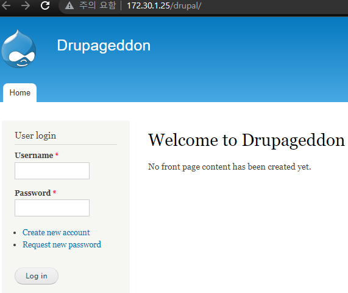

 

## Injection

공격자가 신뢰할 수 없는 입력을 프로그램에 주입하도록 하는 공격.

 

 

## SQL Injection

응용 프로그램 보안 상의 허점을 의도적으로 이용해, 

임의의 SQL문을 주입하여 악의적인 SQL문을 실행하게 함으로써

DB를 비정상적으로 조작하는 코드 인젝션의 대표적인 공격.

이로인해 공격자가 DB에 저장되어 있는 다른 사용자의 개인 정보 등 허가되지 않은 정보에 접근하여,

데이터 변조 및 조작 가능.

 

### Drupal

블로그 서비스의 한 종류

CVE-2014-3704 : Drupal에서 확인된 SQL Injecion 취약점

 

 

## Object

관리자 계정을 알아내 로그인 해보자

- Durpal을 눌러보면 

- 이런식으로 접근가능하고 CVE-2014-3704로 이동해보자.

- 34993번을 칼리에서 다운로드 받아서 코드를 살펴보자

 

### KALI

- url을 처음에 열어봤던 본인 bWAPP의 Drupal 페이지 url로 바꿔준다.

 

- 바로 PHP 명령어로 해당 소스코드 실행해주면 계정정보 뜸.

 

### 결과

- 로그인 성공

 

 

## 대응방안

