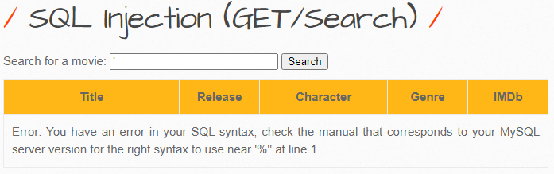
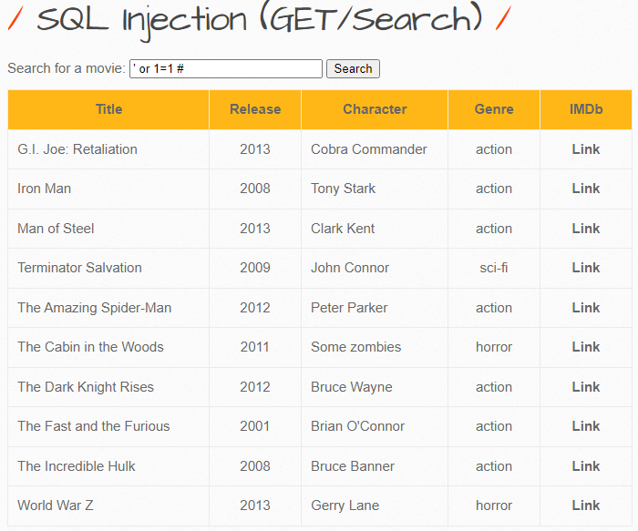
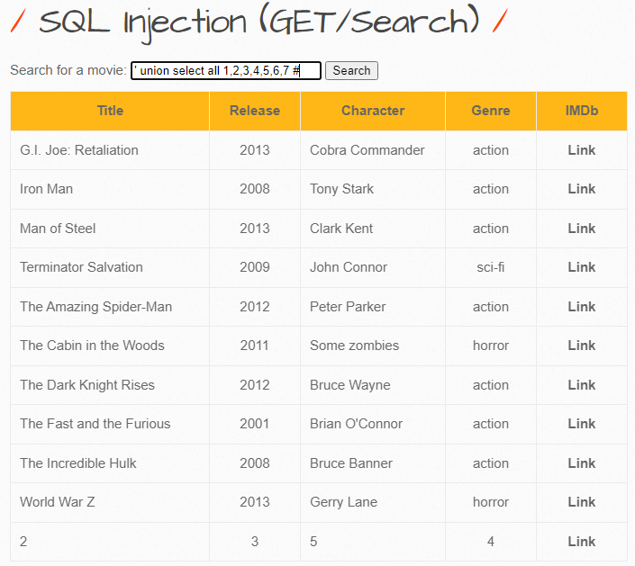
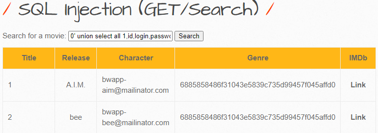
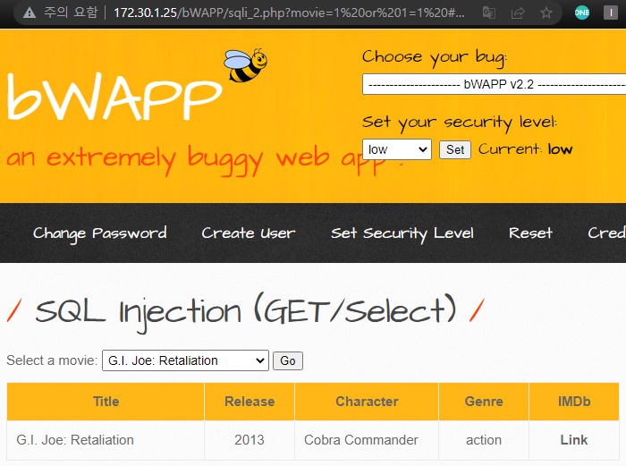

 

## Injection

공격자가 신뢰할 수 없는 입력을 프로그램에 주입하도록 하는 공격.

 

 

## SQL Injection

응용 프로그램 보안 상의 허점을 의도적으로 이용해, 

임의의 SQL문을 주입하여 악의적인 SQL문을 실행하게 함으로써

DB를 비정상적으로 조작하는 코드 인젝션의 대표적인 공격.

이로인해 공격자가 DB에 저장되어 있는 다른 사용자의 개인 정보 등 허가되지 않은 정보에 접근하여,

데이터 변조 및 조작 가능.

 

 

## SQL Injection(GET/Search)

### Object

SQL Injection을 이용해 개인정보를 탈취해보자.

 

### GET 방식

클라이언트에서 서버로 어떠한 리소스로 부터 정보를 요청하기 위해 사용되는 메서드

어떠한 정보를 가져와서 조회하기 위해 사용되는 방식

- URL에 변수를 포함시켜 요청
- 데이터를 헤더에 포함하여 전송
- URL에 데이터가 노출
- 캐싱 가능

- url 주목

- 이런식으로 변수 나타나는 것 확인

 

### SQL Injection

먼저 '작은 따옴표로 SQL 구문 오류가 뜨는지 확인하자

- 구문오류 확인으로 SQL 구문이 쓰이는 것을 확인할 수 있다.
- `"SELECT column FROM tables WHERE movie= ' " &movie " ' "` 로 이뤄진 것을 유추할 수 있는데
- 항상 참인 구문을 통해 어떻게 프로세스 되는지 살펴보자
- GET방식이기 때문에 URL에 뜨는 변수에다가 대입해서 진행해도 상관없음.

 

### 항상 참인 구문

- 먼저 &movie 변수가 들어가기전에 열린 작은 따옴표를 닫아주고
- OR로 연결하여 둘 중 하나가 참이면 참이되게끔 설정한다.
- 그러고 1=1 이라는 절대적인 참을 넣고 뒤에는 #으로 주석처리한다.
- 결국 항상 참인 결과로 모든 컬럼 출력되는 것 확인

 

### union select

- 다음은 UNION을 이용해 SELECT문을 조합해보겠다.
- 먼저 현재 DB의 TABLE의 컬럼들의 갯수를 알아야하므로 ' UNION SELECT ALL 1.2.3.... #으로
- 1부터 갯수가 뜰때까지 반복해준다.

- 컬럼 갯수는 7개
- Title칸에는 2번 컬럼, Release에는 3번, Character에는 5번, Genre에는 4번 컬럼이 쓰인것을 확인
- 이 때문에 컬럼 갯수를 알아볼때 일부러 숫자를 이용한 것이다.

 

### database()

- 2번 Title에 현재 데이터베이스의 정보를 알아보도록 하자

  `0' union select all 1,database(),3,4,5,6,7 #`

- 다음과 같이 0으로 지정해주면 앞서 보았던 값들 없앨 수 있다.

 

### table_name

- 'bWAPP'라는 DB 정보를 알았으니 bWAPP의 테이블 정보를 알아보자

  `0' union select all 1,table_name,3,4,5,6,7 from information_schema.tables where table_schema = 'bWAPP'#`

- table_name은 테이블 이름

- from의 information_schema는 mysql내의 모든 DB,테이블,컬럼 정보를 모아둔 메타 정보

  - 콤마로 연결해 다수의 테이블 tables를 지정해주고

- 조건으로 table_schema인 데이터베이스의 조건 bWAPP을 지정해주었다.

 

### column_name

`0' union select all 1,column_name,3,4,5,6,7 from information_schema.columns where table_name = 'users'#`

- coulmn_name은 컬럼이름
- 컬럼을 조회해야하기 때문에 information_schema.columns
- 조건으로 테이블이름은 users 테이블 이용
- 여기서 취약해보이는 id, login, password, email을 조회해보자

 

### 결과

`0' union select all 1,id,login,password,email,6,7 from users#`

- login 값이 순번으로 나오는 갑다.
- 각 컬럼 번호에 조회할 컬럼들을 입력하고
- from -> 테이블은 users 테이블로 지정해주면 다음과 같이 개인취약정보 조회 가능

 

## SQL Injection(GET/Search) 대응방안

 

 

## SQL Injection(GET/Select)

- select 방식으로 text로 injection 불가능
- 그러므로 url에서 진행하도록 하겠음.

### Go

- url에 변수 노출

 

### 항상 참 구문

`http://172.30.1.25/bWAPP/sqli_2.php?movie=1 or 1=1 #%20&action=go`

- GET 방식의 헤더(url 포함)이나 POST 방식의 바디에 포함시켜 진행해야할 때는 따옴표를 생략해주고 변수 값은 항상 0으로 지정한다.

- 지금부터는 GET/Search와 동일하나 Select 특성 상 하나만 조회가 되므로

- limit 함수를 끝에 붙여 limit 0,1 ~limit 5,1 이런식으로 조회해보자

  

- 다음과 같이 이용.

 

 

## SQL Injection(GET/Select) 대응방안

 

 

## SQL Injection(POST/Search)

### POST 방식

클라이언트에서 서버로 리소스를 생성하거나 업데이트하기 위해 데이터를 보낼 때 사용되는 메서드

데이터를 서버로 제출하여 추가 또는 수정하기 위해 사용하는 방식

- URL에 변수 노출하지 않고 요청
- 데이터를 헤더가 아닌 바디에 포함
- URL에 데이터 노출 X
- 캐싱 가능

- GET/Search와 동일하게 진행

 

 

## SQL Injection(POST/Search) 대응방안

 

 

## SQL Injection (AJAX/JSON/jQuery)

### AJAX/JSON/jQuery

비동기식 처리 모델로서 동기식 처리와는 달리 테스크를 병렬적으로 작업을 수행하는데 실시간 작업에 적합,

- 다음과 같이 실시간으로 자동조회가 됨
- 이후는 GET(Search)와 동일

 

 

## SQL Injection (AJAX/JSON/jQuery) 대응방안

 

 

## SQL Injection (CAPTCHA)

- captcha를 풀고 들어가면

- 이런식 이후는 GET/Search와 동일

 

 

## SQL Injection (CAPTCHA) 대응방안

 

 
