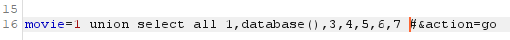
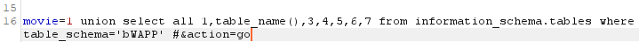

 

## Injection

공격자가 신뢰할 수 없는 입력을 프로그램에 주입하도록 하는 공격.

 

 

## SQL Injection

응용 프로그램 보안 상의 허점을 의도적으로 이용해, 

임의의 SQL문을 주입하여 악의적인 SQL문을 실행하게 함으로써

DB를 비정상적으로 조작하는 코드 인젝션의 대표적인 공격.

이로인해 공격자가 DB에 저장되어 있는 다른 사용자의 개인 정보 등 허가되지 않은 정보에 접근하여,

데이터 변조 및 조작 가능.

 

### POST 방식

클라이언트에서 서버로 리소스를 생성하거나 업데이트하기 위해 데이터를 보낼 때 사용되는 메서드

데이터를 서버로 제출하여 추가 또는 수정하기 위해 사용하는 방식

- URL에 변수 노출하지 않고 요청
- 데이터를 헤더가 아닌 바디에 포함
- URL에 데이터 노출 X
- 캐싱 가능

- POST 방식에 Select 방식으로 삽입할 곳 없기 때문에 BurpSuite 이용하겠다.

 

### BurpSuite

- 버프수트를 통해서 패킷을 잡아주면
- 바디부분에 movie 변수와 값이 뜨는 것 확인

 

### 진행

- DB정보 알아내고

- 알아낸 DB의 테이블 정보 조희

- 알아낸 테이블의 컬럼들 조회
- 변수 값은 항상 0으로 고정해주자.

- 한 번에 하나의 컬럼들만 조회되기 때문에 limit 함수 이용해서 1,1~ 2,1~6,1, 등으로 조회하기

- 결과 확인

 

 

## 대응방안

