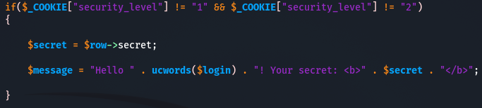

 

## Broken Authentication

인증과 세션 관리와 관련된 애플리케이션 기능이 정확하게 구현되어 있지 않아서

공격자가 패스워드, 키 또는 세션 토큰을 위험에 노출 시킬 수 있거나 

일시적 또는 영구적으로 다른 사용자의 권한 획득을 위해 구현상 결함을 악용하도록 허용한 것을 말함.

### Brute - Force Access

무차별 대입 공격

조합 가능한 모든 경우의 수를 다 대입하여 올바른 암호가 발견될 때까지 시도하는 과정

 

### Credential Stuffing

  

  수집된 사용자 이름과 비밀번호를 자동으로 대입하여 사용자 계정에 부전하게 엑세스하려는 공격.

일종의 Brute Force 기법이지만

데이터 침해에서 입수한 알려진 유효 인증 정보 목록을 이용한다는 점에서 차이가 있음.

 

### Dictionary

무차별 대입이라는 특징을 그대로 구현한 '무작위 순차 대입'과

상당한 시간이 소요되는 무차별 대입 방식의 단점을 극복 및 보완한 공격 기법.

미리 정의된(사전 파일) 문자열 목록을 대입하는 방법.

사전 파일은 그동안 통계적으로 많이 사용되거나, 사람들이 흔히 사용할법한 비밀번호 조합을 미리 목록으로 정의해 둔 파일.

 

 

## Forgotten Function

이 시나리오는 레벨별로 간단하게 코드를 보면서 이런 보안이 적용되어있다라고만 알고 넘어가겠다.

- Secret 코드를 잃어버렸을 때 E-mail을 입력해서 알려주는 시나리오

 

### Level = Low = 0

- Low 일 때 secret이 웹 페이지에 그대로 출력.

- vi 편집기로 ba_forgotten.php 소스코드를 살펴보니 secret을 웹페이지에 출력.

 

### Level = Medium = 1

- Medium 일 때 Secret 을 이메일과 함께 보냄.

- smtp 서버를 사용해서 나의 시크릿 코드를 이메일과 동봉해 보내고 있다.

 

### Level = High = 2

- High 일 때는 reset code를 이메일과 함께 보냄

- smtp 서버를 사용해서 High 일 때는 random_string을 해시함수화한 reset_code를 내 메일에 동봉해 보내준다.