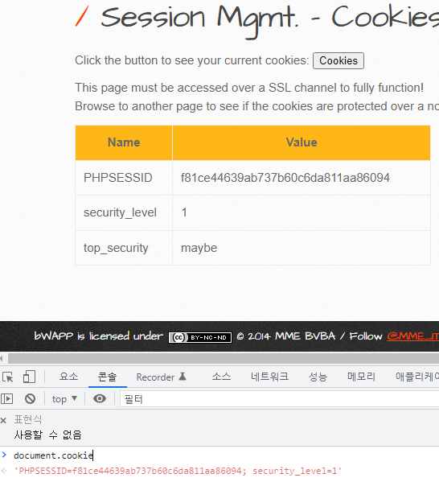

 

## Session Mangement

사용자가 서버에 ID/PW 등을 통해 인증된 경우 접속 유지 역할을 수행하는 세션이 생성되는데 이러한 세션은 사용자 인증, 접속 관리, 권한 관리 등으로 사용된다.

이러한 세션이 취약하게 관리되거나 사용자 세션에 대한 적정성 검토가 제대로 이루어지지 않을 경우 공격자에 의해 권한 상승, 계정 탈취 등의 위험도 높은 공격으로 이루어질 수 있다.

 

### Session Hijacking

공격자가 인증 작업 등이 완료되어 정상통신을 하고 있는 다른 사용자의 세션을 가로채 별도의 인증 작업 없이 가로챈 세션으로 통신을 계속하는 행위

ID, PW를 몰라도 시스템에 접근가능한 공격이며,

인증 작업이 완료된 세션을 공격하기 때문에 OTP, Challenge/Response 기법을 사용하는 사용자 인증을 무력화 시킴.

 

 

## Cookies (Secure) - 난이도 : 하

쿠키에는 세션 ID가 저장되는데, 쿠키의 옵션 중 Secure에 관한 문제이다.

- Secure는 Set-Cookie 라는 php 함수의 옵션인데
  - Set-cookie : 서버가 클라이언트의 쿠키를 설정하는 함수
- HTTPS 통신을 수행하는 경우에만 쿠키를 전송하는 옵션이다.
- Cookies라는 버튼과 개발자모드 콘솔에서 document.cookie를 출력해보자

 

- secure 옵션에 관한 문제이지만 document.cookie를 통해서 top_security에 httponly 옵션이 적용된 것을 확인할 수 ㅣ있다.
- 그렇다면 버프수트를 통해 응답값에서 secure 옵션과 httponly 옵션을 동시에 확인해보자.

 

### BurpSuite

- 패킷을 Intercept 하기전에 요청값을 꺼주고 응답값을 켜준 후 응답 패킷을 살펴보겠다.
- set-cookie 함수는 응답 패킷에서 확인할 수 있기 때문이다.

 

### http -> https

- 먼저 secure 옵션을 확인하기 위해서는 https 통신에서만 확인할 수 있기 때문에 url의 http를 https로 바꿔준 후 패킷을 캡쳐해보자.
- 10번 줄을 봐주면 되는데 top_security에 Set-Cookie가 적용되어있고 secure는 비활성화 httponly는 활성화되어 있는 것을 확인할 수 있다.

 

 

## Cookies (Secure) - 난이도 : 중

- 마찬가지로 top_security에 httponly가 적용된 것을 육안으로 확인할 수 있고,
- secure 적용 옵션을 1차원적으로 확인해보기 위해 http 페이징서 똑같은 방벙브로 Cookies 버튼을 눌러주자

 

- http에서는 top_security 통신이 되지않는 것으로 보아 top_security에 secure 옵션이 적용된 것을 육안으로 확인할 수 있다.

 

### BurpSuite - https

- https로 접속한 페이지에서 패킷을 캡쳐해주면
- 다음과 같이 secure 옵션과, httponly 옵션이 활성화되어 있는 것을 확인할 수 있다.

 

 

## Cookies (Secure) - 난이도 : 상

- 난이도 상에서 또한 마찬가지로 top_security 쿠키 값에 httponly 옵션 적용된 것 확인했고

- http 페이지에서 Cookies 버튼을 눌러 secure 옵션 또한 적용된 것을 확인할 수 있다.

 

 

## 대응방안

### Linux

- vi 편집기를 이용해 smgmt_cookies_secure.php 소스 코드를 조히해보면
- Level 0 (하) 에서 top_security라는 쿠키에 유효기간 1시간, secure false, httponly true
- Level 1 (중) 에서 top_security라는 쿠키에 유효기간 1시간, secure true, httponly true
- Level 2 (상) 에서 top_security라는 쿠키에 유효기간 5분, secure true, httponly true
  - 를 통해서 secure의 여부와 난이도 중 상에서의 유효기간 차이를 통해 보안을 적용하는 것을 확인할 수 있다.