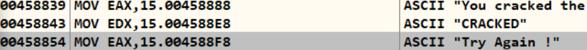
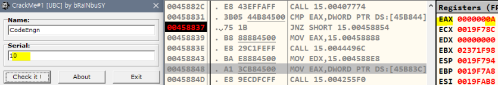

 

## L15

### 문제

Name이 CodeEngn 일때 Serial을 구하시오

 

### 파일 실행

올리디버거

All referenced text string

분기점

F9

- EAX에 User 입력 값 16진수
- 분기 위 CMP를 통해 DWORD PTR DS : [45B844]에 Serial 값 들어있을거라 판단
- DWORD PTR로 받아오니 45B844 덤프의 4Byte만 측정

Follow in dump - Memory address

Dump Window

- Intel은 리틀엔디안으로 00006160
- 00006160 10진수로 변환 : 24928

결과

- NAME = CodeEngn ;
- Serial = 24928

분석

- 분기 함수가 있는 군집 코드
- 함수 호출하는 CALL 분석

CALL 15.00458760

- CALL 15.004255C0 : strlen으로 입력한 NAME 길이 값 EAX에 받아옴
- CALL 15.0040383C : NAME 주소(0045B840)를 EAX에 저장
- XOR로 EAX 값 비워줌

- EAX 값 다시 반환
- ESI에 1넣고 EAX값을 감소시키며 반복문 통해 NAME의 문자열 하나하나 연산

- 반복문 끝나고 나서의 EBX값 00001818

- EAX 초기화 전까지 연산
- EBX : 00006061
- EAX : 00006061
- 즉 Serial 값 도출