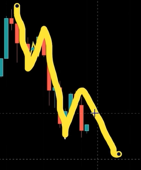
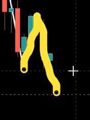
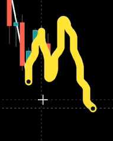
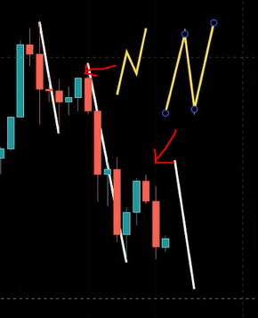
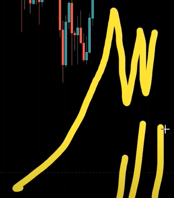

1. 이중 되돌림 조정

   

   - 일반

- 플랫

​	- 왼쪽의 이중 지그재그와는 다른 패턴

2. 시즌종료

   조정구간에서 항상 시즌종료라는 말 나옴

	- 기준 : 고점의 모양(차트 상승시 상승의 모양) + 거래량

- 실제 시즌 종료시
  - 미친듯이 상승하고
  - 고점에서 왔다갔다함 - 이때 거래량 막 터짐

3. 포트폴리오 구성

   - 현재 nft, 게임 코인이 인기

     ex) Gala, 위믹스 and so on..

   - 자산 1000일때 700 = nft, 게임, 메타에 맞는 코인

   - 나머지 300은 매집된 코인 추천

     ex) 온톨로지 (900~1000 사이 추천)

     ex) 파일코인, 이클, 라이트 코인

선물 거래에서 중요한 것

- 상승장에선 숏 X 공매도 X
- 하락장에서 롱 X 공매수 X

